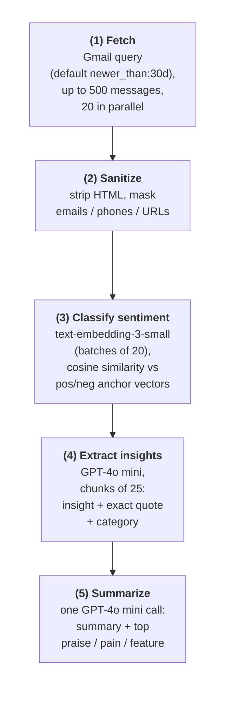
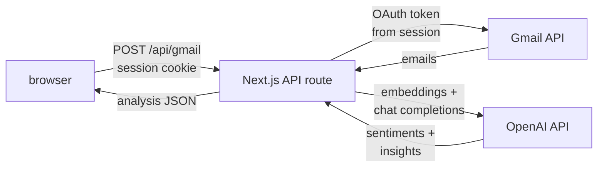

Professional work and personal prototypes.

## Vibecheck

*Vibecheck* is an inbox analysis tool for analyzing feedback sentiment. I protoyped this in ~2024 as an architectual exercise and to review AI engineering techniques: batching, parallelization, chunking, and token management. After Google Gemini release Gmail integration, I shelved it.

<video src="/img/vibecheck-demo.webm" controls playsinline preload="metadata"></video>

### Analysis pipeline

### Request flow

## Sprigbase

*Sprigbase* was a prototype RAG Slack bot for saving and retrieving conversation thread context. Chat commands let you (1) save threads and (2) question the bot, retrieving the answer from a flat file using keyword matching to prefilter chunks before semantic similarity search. Weekend curiosity, not tracked on GitHub.

## Nukes D3 viz

Simple D3.js data viz using a public nuclear-inventory-by-country dataset. I cleaned and manually inspected the data for validation by comparing it to known nuclear inventory estimates.

## Windows reboot policy

Custom Windows Reboot detection and remediation policy. Created PowerShell script and deployed via Intune. The script created UI from scratch and was changed later to simply use existing Windows toast notifications.

